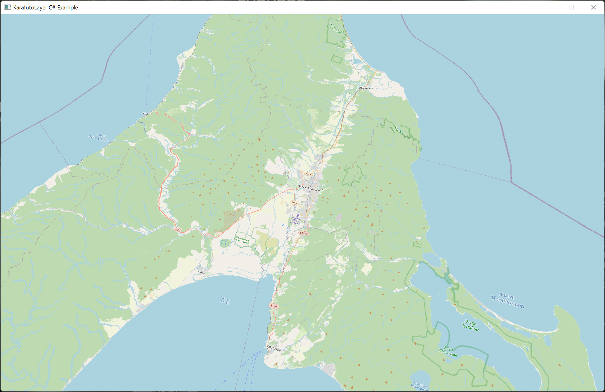

# Karafuto Layer C# Example

Dynamic linking example with the Raylib Framework (C#).

### How to use

The renderer is configured to use the `Assets/elevation` directory. 
Place here all unpacked SRTM files and replace the paths inside `Source/Scene.cs`.
The coordinates of origin are set inside `Source/Scene.cs` on the outskirts of Yuzhno-Sakhalinsk (46.9641° N, 142.7285° E).
Rendering starts as soon as the compiled application is started.
